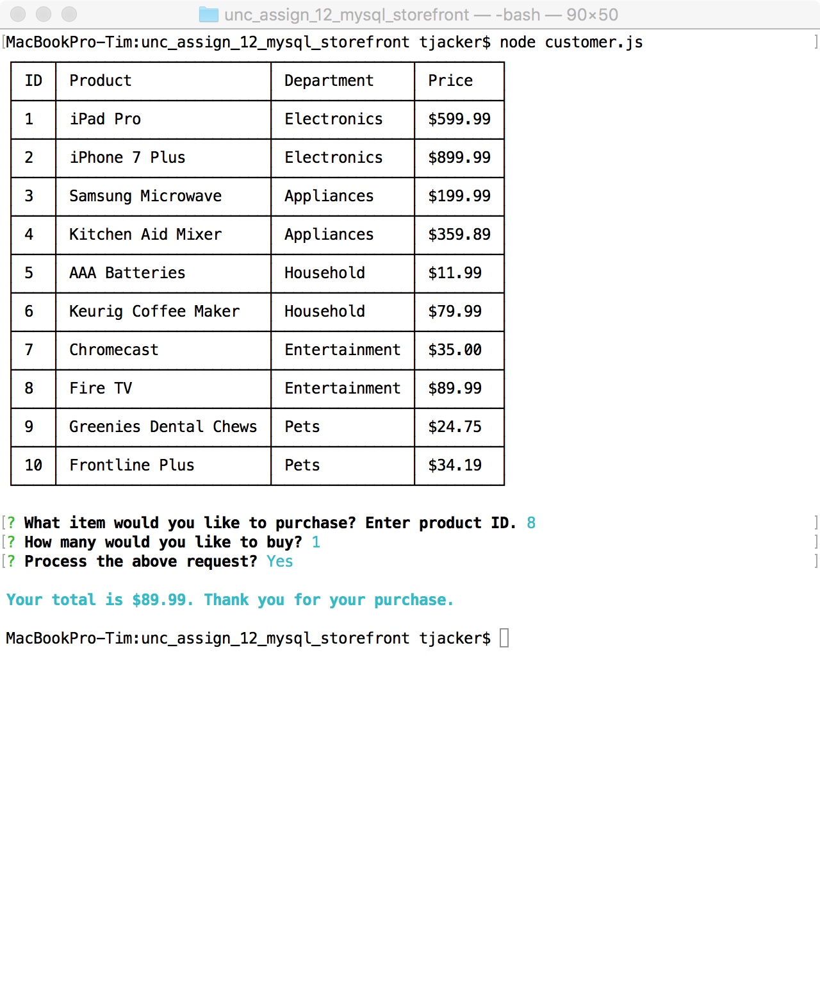

# MySQL Storefront
UNC Boot Camp Assignment 12 MySQL Storefront

View [app demo](https://youtu.be/LeTx81NLUWc) on YouTube.

In this activity, I created a storefront using Node.js and MySQL. There are 3 ways to run this application:

## Customer

```node customer.js```

This is the customer mode where a user can view the products table and make a purchase by entering a product id and quantity. The products table displays the product id, product name, department name and quantity. After the user enters the information they are presented with a confirmation prompt where they can accept or cancel the transaction.


