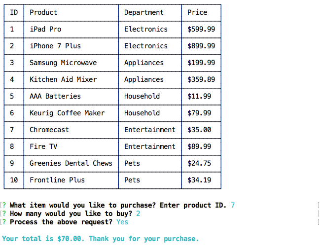
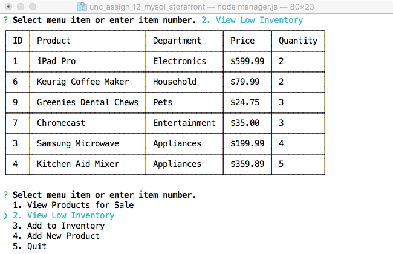
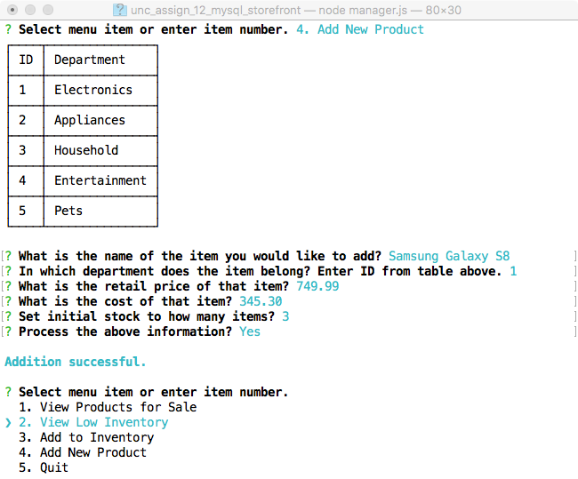
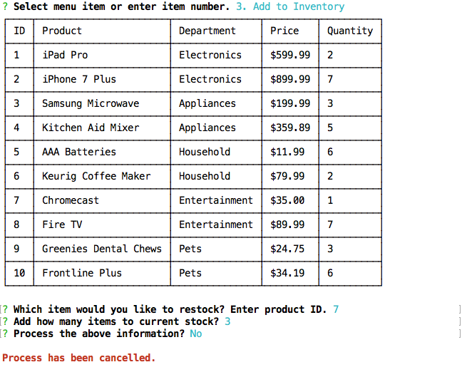
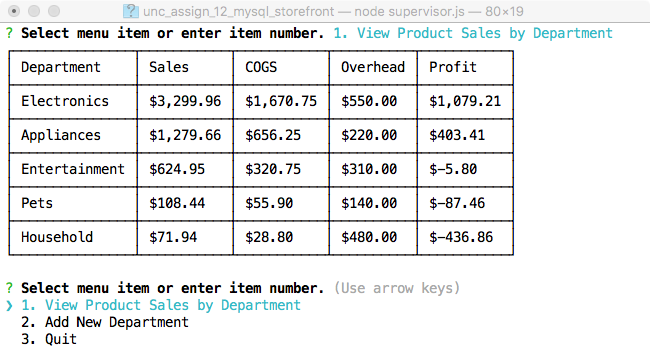

# MySQL Storefront
UNC Boot Camp Assignment 12 MySQL Storefront

Click image above to view app demo on YouTube.

In this activity, I created a CLI storefront using Node.js and MySQL. There are 3 ways to run this application:

## Customer

`node customer.js`

This is the customer node where a user can view the products table and make a purchase by entering a product id and quantity. The products table displays the product id, product name, department name and price. After the user enters the information, they are presented with a confirmation prompt where they can accept or cancel the transaction. If the user tries to enter something other then a product ID in the first prompt or does not input a positive whole number in the second prompt, validation warnings are returned informing the user to enter the information in the correct format which prevents the app from continuing until the user enters the information correctly.

If the user tries to purchase more items than are currently in stock an "Insufficient quantity available" message is returned.

Otherwise, the order is fulfilled and a confirmation message with the total spent is displayed.

## Manager

`node manager.js`

In the manager node, the following options can be preformed:

1. View Products for Sale
2. View Low Inventory
3. Add to Inventory
4. Add New Product
5. Quit

##### View Products for Sale
This allows the manager to view the products table which is the same view as in the customer node with the addition of a quantity field.

##### View Low Inventory
The low inventory view shows products that have 5 or fewer items in stock, starting with items which have the fewest.

##### Add to Inventory
This shows the full product table and allows the manager to add inventory to items with an existing product ID.

##### Add New Product
As the name implies, this is the option the manager would use to add a new product to the products table. The department table is shown to make selecting the appropriate department the product should be assigned easier.

##### Quit
The final option let's the manager quit the application, returning to the main prompt.

**Note:** As with the customer node, the prompts in the manager node will validate the user's input to make sure information is entered correctly. Once the information is entered in the correct format, the manager will receive a confirmation prompt, giving them the chance to cancel the process if necessary.

## Supervisor

`node supervisor.js`

The supervisor node includes the following 3 options:

1. View Product Sales by Department
2. Add New Department
3. Quit

##### View Product Sales by Department
This shows sales by department with the most profitable department listed first. The table displays the department name, total sales, total cost of goods sold (COGS), overhead costs and profit (or loss if negative).

##### Add New Department
This option allows the supervisor to create a new department that a manager can later add products to for tracking Sales. The supervisor is first presented with a list of existing departments for reference. The same validation and confirmation functionality that exists throughout the program is applied here as well.

##### Quit
The final option let's the supervisor quit the application, returning to the main prompt.

This completes the instructions on the how to run this application.
